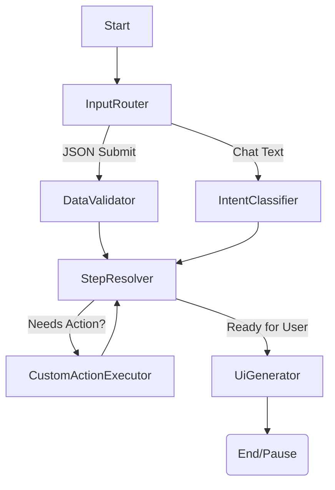

# Project Context: Agentic Leave Intake Wizard

## 1. High-Level Architecture
**Goal:** Build a stateful, dynamic intake wizard for Employee Leave Requests (FMLA, Pregnancy, etc) using **LangGraph v1** and **TypeScript**.
**Pattern:** Circular State Machine with Human-in-the-Loop Interrupts.
**Core Philosophy:** The graph acts as the backend "Redux Store" and Rule Engine. It persists state between user sessions, allowing for a "Save and Return" capability automatically via Checkpointers.

## 2. Tech Stack & Libraries
*   **Runtime:** Bun / TypeScript
*   **Orchestration:** `@langchain/langgraph` (Low-level `StateGraph` API)
*   **LLM Interface:** `@langchain/google-genai` / `@langchain/core`
*   **Validation:** `zod`
*   **State Storage:** LangGraph Checkpointer (Postgres or MemorySaver for dev)

## 3. The State Schema (The "Store")
The global state matches a Redux-like pattern. It holds both conversational context and rigid business data.

```typescript
import { Annotation } from "@langchain/langgraph";
import { BaseMessage } from "@langchain/core/messages";

export const WizardState = Annotation.Root({
  // 1. Conversation History (Append-only reducer)
  messages: Annotation<BaseMessage[]>({
    reducer: (curr, update) => curr.concat(update),
    default: () => [],
  }),

  // 2. The Wizard "Form Data" (Merge/Overwrite reducer)
  // This holds the actual answers (e.g., { leaveType: 'Medical', startDate: '2023-01-01' })
  wizardData: Annotation<Record<string, any>>({
    reducer: (curr, update) => ({ ...curr, ...update }),
    default: () => ({}),
  }),

  // 3. Flow Control
  currentStepId: Annotation<string>(), // The ID of the current active step
  status: Annotation<"IN_PROGRESS" | "REVIEW" | "COMPLETED">(),
  
  // 4. UI Contract (The Generative UI Payload)
  // The Frontend reads this to know what to render next
  uiPayload: Annotation<{
    type: "form" | "message" | "review";
    schema?: any; // JSON Schema for the form
    data?: any;   // Pre-filled data
  }>(),
});
```

## 4. The Graph Workflow (Nodes & Edges)
The graph uses a "Diamond" pattern to handle both structured form submissions and unstructured chat.

### The Nodes
*   **InputRouter (The Edge/Gatekeeper):**
    *   Checks input type.
    *   If `FORM_SUBMIT` -> Routes to `DataValidator`.
    *   If `USER_MESSAGE` -> Routes to `IntentClassifier`.
*   **IntentClassifier (LLM Node):**
    *   Analyzes chat text.
    *   Decides: Is this data extraction (filling the form via chat) or a generic policy question?
    *   Extracts entities if applicable.
*   **StepResolver (The Brain/Rule Engine):**
    *   Determines the next step based on `wizardData` and Business Rules.
    *   Evaluates conditional logic (e.g., "If CA resident, add CFRA step").
    *   Decides if a Tool needs to be called.
*   **CustomActionExecutor (The "Hand"):**
    *   **CRITICAL:** We do NOT use the prebuilt `ToolNode`.
    *   We use a custom node to execute tools (e.g., `save_progress`, `calculate_entitlement`).
    *   **Why:** This node must update `state.wizardData` synchronously in the same transaction, not just append a `ToolMessage` to history.
*   **UiGenerator (The Presenter):**
    *   Generates the `uiPayload` JSON.
    *   Ends the run with an Interrupt.

### The Flow Visualization


## 5. Critical Implementation Details

### A. The "Interrupt" Pattern
*   We use interrupt (Human-in-the-Loop) to pause execution and wait for user input.
*   **Resume:** When the user replies/submits, the API calls `graph.invoke(new Command({ resume: payload }))`.
*   **Persistence:** This effectively solves "Save for Later." The Checkpointer saves the state at the interrupt.

### B. Custom Tool Execution Node
We strictly avoid the generic `ToolNode` because it isolates state changes to the messages array.

**Requirement:**
When a tool runs (e.g., `validate_dates`), it must return a complex object update:
```typescript
return {
   messages: [new ToolMessage(...)], // Keep LLM happy
   wizardData: { startDate: "2023-01-01" }, // Update App State directly
   validationErrors: [] 
}
```

### C. Generative UI Protocol
*   The backend drives the frontend structure.
*   The `UiGenerator` node produces a JSON Schema / UI Definition.
*   The Frontend (React) maps this schema to components (`DatePicker`, `FileUpload`, `ReviewScreen`).

## 6. Glossary (Frontend/Redux to LangGraph Mapping)
*   **Store** -> GraphState (The Annotation Definition)
*   **Reducer** -> Annotation reducer functions
*   **Dispatch Action** -> A Node returning a value
*   **Selector** -> Conditional Edge logic
*   **Middleware/Thunk** -> Node execution (Async work)
*   **PersistGate** -> Checkpointer


